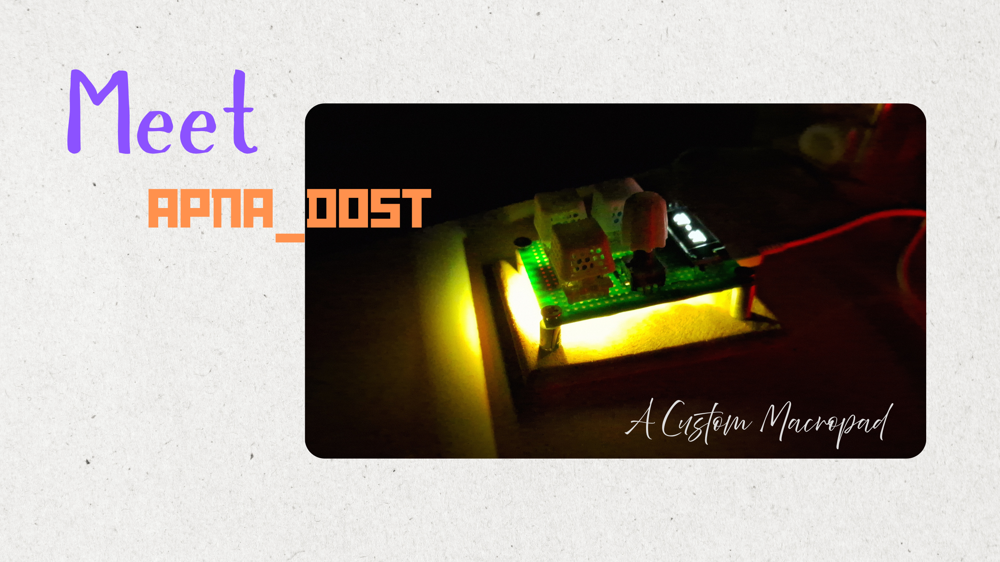
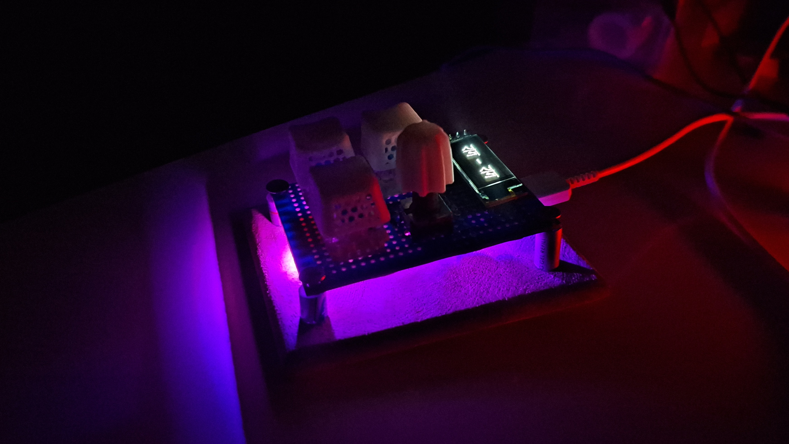
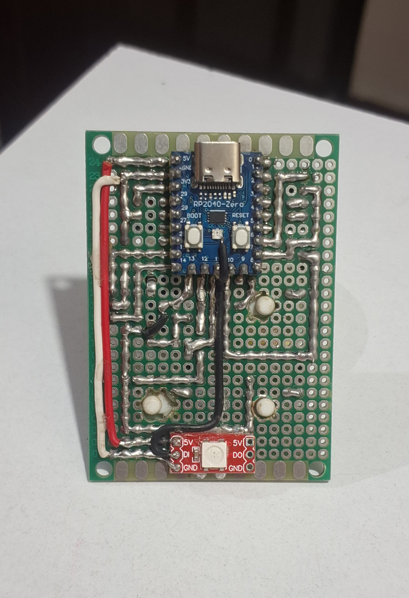
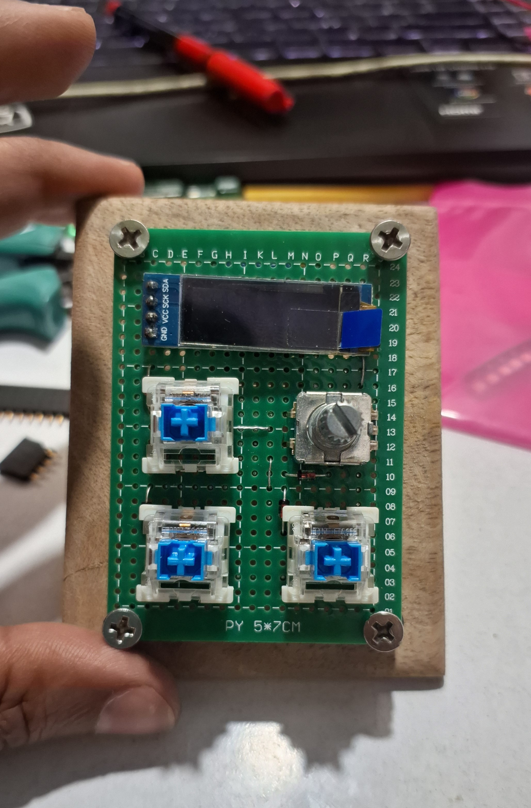
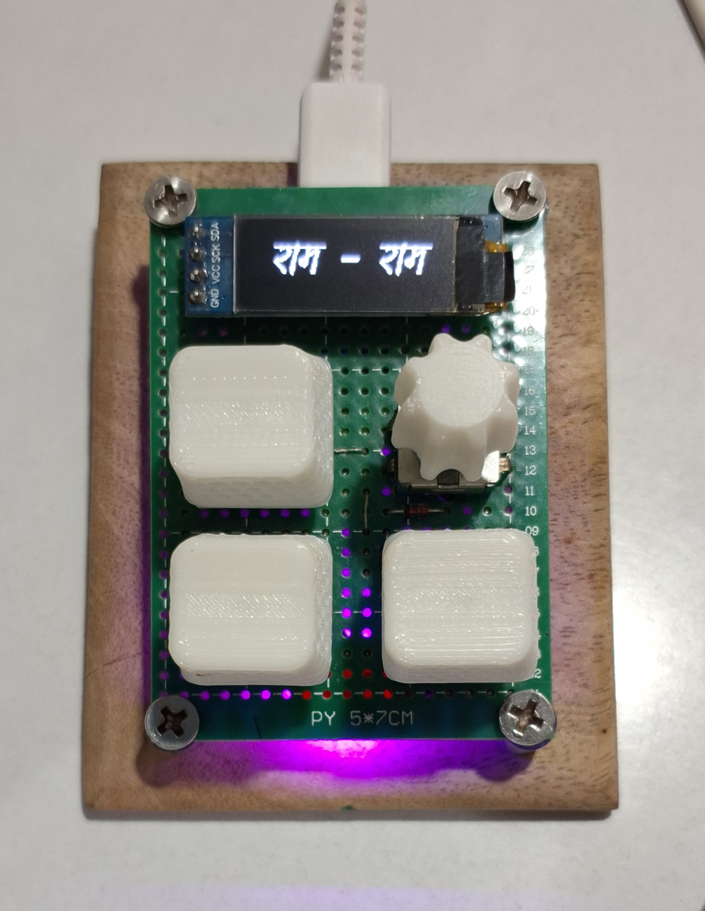

# Apna Dost - Custom 2x2 QMK Macropad



A compact and powerful desktop macropad built around the RP2040-Zero, featuring an OLED display, rotary encoder, RGB lighting, and fully customizable QMK firmware.




## ✨ Features

- 2x2 Mechanical Key Matrix with 1N4148 diodes (Zero ghosting)
- SSD1306 OLED Display using hardware I2C
- EC11 Rotary Encoder with push switch
- RGB Lighting with Dual-LED Hack
- Easy `.uf2` firmware flashing
- Custom PCB + Zero PCB support

## 📋 Specifications

| Feature | Details |
|----------|----------|
| MCU | RP2040-Zero |
| Display | SSD1306 OLED |
| Encoder | EC11 Rotary Encoder |
| Firmware | QMK |
| PCB | Custom Designed |
| RGB | Dual LED RGB Hack |

## 📸 Gallery





## 📁 Project Structure

```text
Apna_dost/
├── Firmware/           # QMK source files
├── Gerber/             # PCB manufacturing files
├── Hardware/
│   └── photos/         # Build photos
├── Schematic/          # Circuit diagrams
├── demo_video.mp4
└── README.md
```

## 🛠️ Quick Start

### 1. Order PCB

📥 Download the Gerber files from the `Gerber/` folder and upload them to:
- JLCPCB
- PCBWay
- Elecrow

### 2. Flash Firmware

```bash
qmk compile -kb apna_dost -km default
```

Put the RP2040-Zero into bootloader mode and drag the generated `.uf2` file onto the device.

## 📥 Downloads

- Gerber Files
- Schematic
- Firmware Source

## 🎥 Demo Videos

* [Watch Demo Video 1](Videos/demo_video.mp4)
* [Watch Demo Video 2](Videos/rgb.mp4)


## 📜 License

This project is open-sourced under the MIT License.

---

Made with ❤️ by **NP-Vishwakarma**

Feel free to fork, modify, and build your own version. Tag me if you make one!
